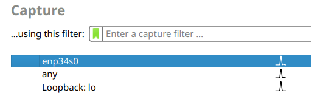

# Scapy

Analiza različitih vrsta mrežnog saobraćaja i manipulacija paketima pomoću Scapy biblioteke u Pythonu, uključujući snimanje i presretanje
___

## Sadržaj
- [Scapy overview](#scapy-overview)
- [Tehnologije i alati](#tehnologije-i-alati)
- [Instalacija](#instalacija)
- [Projekti](#projekti)
- [Literatura i resursi](#literatura-i-resursi)
___

## Scapy overview

**Scapy** je Python biblioteka namenjena manipulaciji i analizi mrežnog saobraćaja, koja omogućava rad sa *raw socket*-ima i može koristiti biblioteke poput *libpcap* za snimanje saobraćaja.

*Libpcap* je biblioteka koja omogućava presretanje i snimanje mrežnog saobraćaja na niskom nivou, dok ,,raw'' socket-i omogućavaju slanje i primanje ,,sirovih'' (neobrađenih) mrežnih paketa.

Neke od mogućnosti koje Scapy pruža su kreiranje, slanje, primanje i analiziranje mrežnih paketa uz visoku kontrolu nad njihovom strukturom i sadržajem.

Uz podršku za veliki broj mrežnih protokola, kao što su Ethernet, IP, TCP, UDP, ICMP, itd, Scapy pruža fleksibilnost i funkcionalnosti koje prevazilaze mogućnosti klasičnih mrežnih alata.

Scapy je koristan alat u oblastima mrežne administracije, sajber bezbednosti i istraživanja mrežnih protokola. Omogućava jednostavan, ali detaljan rad sa mrežnim saobraćajem na niskom nivou.

### Ključne mogućnosti koje pruža Scapy

- Kreiranje mrežnih paketa uz detaljno podešavanje polja u skladu sa [RFC standardima](https://www.rfc-editor.org/standards) 
- Analiza mrežnih paketa u cilju otkrivanja potencijalnih problema ili anomalija
- Automatizaciju složenih mrežnih zadataka putem Python skripti

### Prednosti

- Fleksibilnost u kreiranju i analizi prilagođenih paketa
- Podrška za veliki broj protokola
- Integracija sa Python-om omogućava jednostavnu automatizaciju

### Mane

- Zahteva razumevanje mrežnih protokola i njihovih struktura
- Ne poseduje grafički interfejs, što može otežati upotrebu početnicima
- Potrebno je dodatno istraživanje mrežnih protokola, što često uključuje čitanje [RFC dokumentacije](https://www.rfc-editor.org/standards)

### Problem koji Scapy rešava

Scapy je alat koji omogućava analizu i manipulaciju mrežnim saobraćajem. Za razliku od tradicionalnih alata poput Wireshark-a, koji su fokusirani na pasivnu analizu, Scapy nudi i aktivnu manipulaciju paketa - tj. korisnik može samostalno kreirati, menjati i slati pakete. Aktivna manipulacija pruža veću kontrolu nad paketima, ali zahteva i poznavanje računarskih mreža i protokola. Takođe, Scapy pruža već definisan set brojnih protokola, što dodatno olakšava rad.

Tokom rada sa Scapy-em se preporučuje i korišćenje [RFC dokumentacije](https://www.rfc-editor.org/standards) koja detaljno definiše mrežne protokole, s obzirom da je u nekim trenucima neophodno menjati specifičnija polja, kao što su zaglavlja i flegovi. 

### Konkurentna rešenja

- **Wireshark** 

Vizuelni alat za analizu mrežnog saobraćaja. Njegove prednosti uključuju intuitivan interfejs, razne opcije za filtriranje i statistiku, kao i dekodiranje protokola. Glavni nedostaci su nemogućnost aktivne manipulacije paketa, kao i ograničenja u brzini pri radu sa velikim količinama podataka.

- **Pyshark** 

Python biblioteka zasnovana na Wireshark-u, koja omogućava analizu mrežnog saobraćaja kroz Python skripte. Prednosti Pyshark-a uključuju lakoću integracije sa Python-om i automatsku obradu mrežnih podataka korišćenjem ugrađenih funkcija. Međutim, Pyshark je ograničen kada je u pitanju kreiranje i prilagođavanje mrežnih paketa, jer je primarno fokusiran na pasivnu analizu saobraćaja. Ovo ograničava njegovu primenu u nekim sigurnosnim testiranjima ili istraživanjima mrežnih protokola

- **Tshark** 

Tshark predstavlja CLI verziju Wireshark-a. Pogodan je za korišćenje u headless okruženjima, automatizaciju, kao i snimanje i analizu mrežnog saobraćaja uz korišćenje filtera. Iako je moćan za pasivnu analizu, ne nudi fleksibilnost potrebnu za modifikaciju saobraćaja

Wireshark, Pyshark i Tshark nisu direktni konkurenti u svim slučajevima, jer su više orijentisani na pasivnu analizu, dok je Scapy alat koji omogućava i aktivnu manipulaciju mrežnim paketima.

Osim navedenih, postoje i dodatni alati koji se mogu navesti, kao što su **Netcat**, **Nmap**, **Ettercap** i drugi. Međutim, ovi alati imaju specifičniju primenu, te ih ne treba direktno upoređivati sa Scapy-em.
___

## Tehnologije i alati

Iako je naveden kao konkurentno rešenje, u ovom projektu je korišćen Wireshark za snimanje saobraćaja tokom testiranja. U nastavku, nakon osnovnih informacija o Scapy-u, nalazi se i pregled ključnih funkcionalnosti Wireshark-a.

Tehnologije i alati koji su korišćeni:
- Python (v3.13.3)
- Scapy (v2.6.1)
- Wireshark (v4.4.6)

Projekat je razvijan i testiran na Linux platformi (EndeavourOS), te će uputstvo za instalaciju i pokretanje uključivati korake za Linux, kao i za Windows operativni sistem.

### ⚠️ NAPOMENA!

**Korišćenje alata poput Scapy-a i Wireshark-a za prisluškivanje, analizu ili manipulaciju mrežnog saobraćaja nije legalno na javnim mrežama niti bez dozvole vlasnika mreže. Navedene aktivnosti mogu prekršiti zakone o zaštiti privatnosti i informacionoj bezbednosti, kao što je Krivični zakonik Republike Srbije. Pre upotrebe ovih alata je neophodno informisanje o važećim zakonima i pribavljanje potrebne dozvole kako bi se izbegli potencijalni pravni problemi. Ovaj projekat je namenjen isključivo u edukativne svrhe i realizovan na ličnoj mreži.**

**Takođe, treba imati u vidu da se Scapy može iskoristiti u maliciozne svrhe što, u zavisnosti od tipova uređaja, može dovesti do štete kao što je prekid servisa. Neophodno je razumeti šta skripte rade pre njihovog pokretanja, što podrazumeva i adekvatan nivo poznavanja računarskih mreža.**

### Scapy 101

Konkretniji primeri će biti obrađeni u okviru samog projekta, ali i oni mogu poslužiti kao uvod u Scapy.
U nastavku se može videti osnovna funkcionalnost Scapy-a:

**0) Lista pojedinih protokola i funkcija:**

Protokoli koji se mogu iskoristiti su: `Ether`, `ARP`, `IP`, `ICMP`, `TCP`, `UDP`, `DHCP`, itd.

Neke od osnovnih funkcija: 
- `send()`, `sendp()`

Funkcija `send()` se koristi za slanje paketa na 3. sloju, dok se funkcija `sendp()` koristi na 2. sloju

- `sr()`, `sr1()`, `srp()` 

Funkcija `sr()` se koristi za slanje paketa i primanje odgovora. Funkcija vraća par (tuple) paketa i odgovora, kao i pakete koji nisu dobili odgovore. Funkcija `sr1()` služi za slanje, ali prima samo jedan paket tj. odgovor. Protokoli moraju biti sa 3. sloja (kao što je `IP`). Za 2. sloj se koristi funkcija `srp()`. Ukoliko odgovor ne postoji, dodeljuje se `None` vrednost nakon timeout perioda

- `ls()`

Služi za prikazivanje dostupnih slojeva ili prikaz informacija o konkretnom sloju

- `sniff()`

Funkcija za presretanje paketa

- `rdpcap()` i `wrpcap()`

Funkcije za čitanje i čuvanje fajlova koji sadrže presretnut saobraćaj, respektivno

- `Randshort()`

Prilikom slanja određenih tipova paketa, Scapy koristi predefinisane portove kao izvorišne. Moguće je samostalno definisati izvorni port prilikom slanja paketa, ali se može iskoristiti i funkcija `Randshort()` za generisanje nasumičnog broja porta 

- `get_if_hwaddr()`

Funkcija za dobijanje MAC adrese trenutnog interfejsa

**1) Importovanje:**
```py
from scapy.all import <protokol_ili_funkcija>
```
- Primer:
```py
from scapy.all import IP, sr1
```
U ovom slučaju se u projektu mogu iskoristiti `IP` protokol za kreiranje i obradu paketa, kao i funkcija `sr1`

**2) Kreiranje paketa - "layer stacking":**

Scapy koristi operator `/` za slaganje slojeva protokola kako bi se kreirali paketi. Svaki sloj može da predefiniše polja iz donjih slojeva. Takođe, poslednji sloj može biti string:

```py 
# IP sloj
IP()

# IP sa TCP slojem
IP()/TCP()

# Ethernet + IP + TCP
Ether()/IP()/TCP()

# Dodavanje podataka u paket
IP()/TCP()/"GET / HTTP/1.0\r\n\r\n"
```

**3) Konverzija paketa u raw podatke i obrnuto:**

Moguće je paket konvertovati u bajtove radi detaljnije analize, a zatim ga konvertovati u neki drugi tip paketa:

```py
# Kreiranje raw paketa
raw_packet = raw(IP())

# Pretvaranje raw niza u Ether paket
packet_e = Ether(raw_packet)

# Pretvaranje raw niza u IP paket
packet_i = IP(raw_packet)

print(raw_packet)
    => b'E\x00\x00\x14\x00\x01\x00\x00@\x00|\xe7\x7f\x00\x00\x01\x7f\x00\x00\x01'
print(packet_e)
    => 00:00:40:00:7c:e7 > 45:00:00:14:00:01 (0x7f00) / Raw
print(packet_i)
    => 127.0.0.1 > 127.0.0.1 hopopt
```

**4) Slanje i primanje paketa - upoređivanje funkcija `sr()` i `sr1()`:**

U sledećem isečku koda je moguće videti kako se kreira jednostavan ICMP (ping) paket, sa određenom destinacijom. Slanje paketa i primanje odgovora se vrši korišćenjem funkcija `sr()` i `sr1()`. Cilj je uporediti rezultate ovih funkcija:
```py
from scapy.all import IP, ICMP, sr1

# Kreiranje ping paketa
packet = IP(dst="<ip_adresa>") / ICMP()

# Slanje paketa i primanje odgovora - sr()
response = sr(packet, timeout=1)

print(response)
    => (<Results: TCP:0 UDP:0 ICMP:1 Other:0>, <Unanswered: TCP:0 UDP:0 ICMP:0 Other:0>)
    # Vidimo tuple strukturu koja sadrzi rezultate operacije slanja, kao i pakete na koje nije pristigao odgovor
answered, unanswered = response

# "answered" je tuple struktura koja sadrzi poslat paket na indeksu 0, a primljen odgovor na indeksu 1
# Iteracija kroz odgovore
for packet in answered:
    print(packet[0].summary())  # poslat paket je na indeksu 0
        => IP / ICMP 192.168.0.10 > <ip_adresa> echo-request 0
    print(packet[1].summary())  # odgovor je na indeksu 1
        => IP / ICMP <ip_adresa> > 192.168.0.10 echo-reply 0 / Padding

# Slanje paketa i primanje odgovora - sr1()
# Ocekujemo jedan paket kao odgovor
response = sr1(packet, timeout=1)

print(response)
    => IP / ICMP <ip_adresa> > 192.168.0.10 echo-reply 0 / Padding
    # Prikazan je paket koji je prepoznat kao odgovor na nas ICMP paket 
```

### Wireshark 101

Wireshark je alat koji služi za presretanje i analizu mrežnog saobraćaja. U nastavku će biti obrađeni samo ključni koraci za snimanje i čuvanje saobraćaja, s obzirom da može biti potrebno generisanje sopstvenih paketa za neke od primera. 
Wireshark sadrži brojne funkcionalnosti, od statistike do filtriranja saobraćaja, ali to neće biti predmet obrade.

⚠️ **Još jednom je potrebno napomenuti da je snimanje saobraćaja na bilo kojoj mreži, računajući fakultetsku, bez dozvole i saglasnosti svih učesnika strogo zabranjeno. Odgovornost i edukacija je ključ prilikom obrade osetljivih tema kao što je ova, s obzirom da se pojedini aspekti i postupci mogu protumačiti kao maliciozni!**

1) Na Windows sistemu se Wireshark može pokrenuti kao bilo koji program, dok je na Linux platformama potrebno pokrenuti ga sa `sudo` privilegijama: `sudo wireshark`

2) U okviru glavnog prozora se mogu videti dostupni mrežni interfejsi. Treba odabrati interfejs na kome se vidi aktivnost na grafikonu sa desne strane, što su najčešće `eth` ili `wlan` interfejsi. Klikom na odgovarajući interfejs se započinje presretanje saobraćaja. Na slici se može videti primer interfejsa, konkretno `enp34s0` na korišćenom Linux sistemu:



3) Da bi se zaustavilo snimanje, potrebno je kliknuti na kvadrat crvene boje u gornjem levom uglu


4) Fajl sa presretnutim paketima se može sačuvati odabirom opcije `File` > `Save` i unošenjem željenog imena. Neke od ekstenzija koje se mogu odabrati su `.pcap` i `.pcapng` 

Dodatna dokumentacija o Wireshark-u se može naći na [sledećem linku](https://www.wireshark.org/docs/)
___

## Instalacija

###  Scapy

Poželjno je korišćenje Python verzije 3.12. 

Prilikom rada sa Python projektima je preporuka kreirati virtuelno okruženje (Virtual Environment - venv):

1) Linux: 
```bash
# Kreiranje virtuelnog okruženja:
python3 -m venv <ime_venva>
# Aktiviranje:
source <ime_venva>/bin/activate
# Instalacija Scapy-a:
## Opcija 1:
pip install -r requirements.txt
## Opcija 2:
pip install scapy
# Deaktiviranje virtuelnog okruženja nakon rada:
deactivate
```

2) Windows:
```bash
# Kreiranje virtuelnog okruženja:
python -m venv <ime_venva>
# Aktiviranje:
<ime_venva>\Scripts\activate
# Instalacija Scapy-a:
## Opcija 1:
pip install -r requirements.txt
## Opcija 2:
pip install scapy
# Deaktiviranje virtuelnog okruženja nakon rada:
deactivate
```

### Wireshark

1) Linux: 

`sudo apt install wireshark`

`sudo pacman -S wireshark-qt`

**Napomena:** Pokretanje Wireshark-a na Linux-u često zahteva `sudo` privilegije.

2) Windows: 

Wireshark se može preuzeti sa [sledećeg linka](https://www.wireshark.org/download.html) 
___

## Projekti
Primeri korišćenja Scapy biblioteke se mogu naći na putanji `project/examples` i mogu se podeliti u dve kategorije:
1) Konkretni primeri koji obuhvataju i osnove rada sa Scapy-em, primarno kreiranje i slanje/primanje paketa (`ex[1-5](...).py`)
2) Primeri koji se odnose na presretanje i analizu saobraćaja, uključujući učitavanje `.pcap`/`.pcapng` fajlova generisanih od strane Wireshark-a (`task[1-2](...).py`) 

Dodatno, pojedini primeri će ukratko biti prikazani u toku prezentacije, ali izvorni kodovi neće biti dostupni na ovom repozitorijumu kako bi se sprečila potencijalna zloupotreba.

### Opis
U nastavku se može naći kratak opis svih dostupnih primera korišćenja Scapy-a: 

- Kategorija 1:
1) `ex1-Pinging_Google.py` - Jednostavan primer kreiranja ICMP (ping) paketa i upućivanje istog na Google server
2) `ex2-TCP_handshake.py` - Simulacija TCP three-way handshake-a, procesa koji se odvija prilikom uspostavljanja TCP komunikacije između klijenta i servera
3) `ex3-DNS_query.py` - Kreiranje nekoliko tipova DNS upita radi dobijanja javnih informacija o endpoint-u
4) `ex4-ARP_scanning.py` - Slanje ARP paketa u lokalnoj mreži radi detekcije dostupnih uređaja
5) `ex5-Rogue_DHCP_identification.py` - Jedan od napada u mreži koji se mogu desiti je postavka neautorizovanih DHCP servera koji bi klijentima slali maliciozne parametre, što može dovesti do preusmeravanja saobraćaja ili gubitka pristupa na mreži. U ovom primeru, slanjem DHCP Discover paketa i analizom odgovora sa mreže se omogućava identifikacija potencijalno neovlašćenih DHCP servera

- Kategorija 2:
1) `task1.py` - Demonstracija korišćenja Scapy-a u cilju presretanja određenog broja paketa i čuvanja u fajlu odgovarajućeg formata
2) `task2.py` - Učitavanje postojećeg fajla sa različitim tipovima mrežnog saobraćaja, praćeno analizom i osnovnom statistikom

Svaki od primera sadrži detaljne komentare u okviru koda.

### Pokretanje
Pokretanje se vrši kao pri pokretanju bilo kog Python programa: `python ./<naziv_fajla>`

**Napomena:** Na Linux-u, za pokretanje programa koji koristi Scapy za snimanje mrežnog saobraćaja ili slanje paketa su potrebne root privilegije, što se može postići pokretanjem programa uz `sudo`, tj: `sudo python ./<naziv_fajla>`.
___

## Literatura i resursi
### Scapy: 
- Zvanična stranica - https://scapy.net/
- Dokumentacija - https://scapy.readthedocs.io/en/latest/
### IETF (Internet Engineering Task Force) standardi i RFC dokumentacija: 
- https://www.rfc-editor.org/standards
### Wireshark:  
- Zvanična stranica: https://www.wireshark.org/  
- Dokumentacija: https://www.wireshark.org/docs/
### `.pcap` fajlovi koji su iskorišćeni za analizu: 
- https://www.netresec.com/?page=PcapFiles